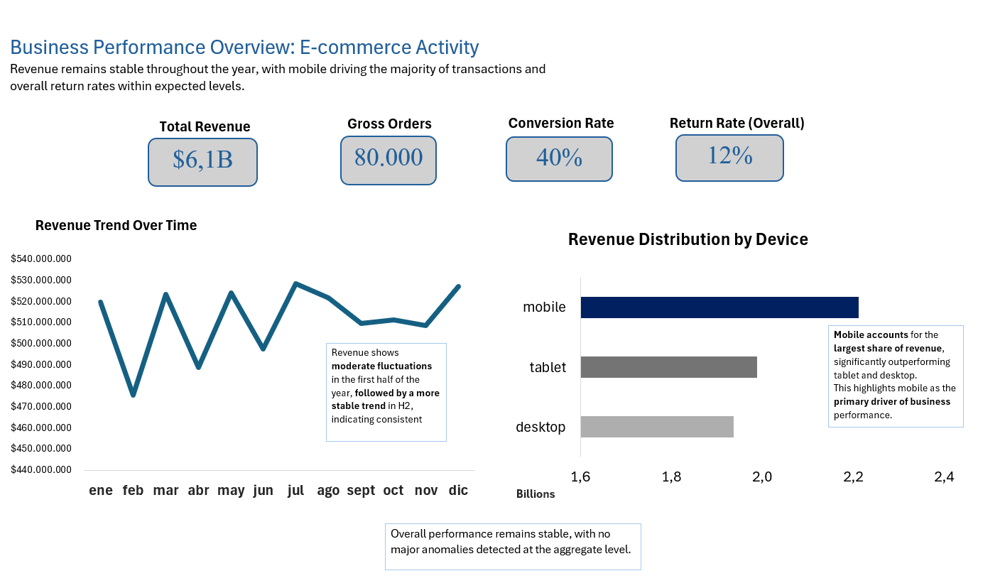
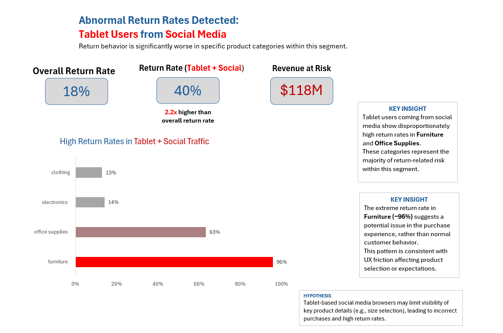

# E-commerce Return Rate Analysis (Excel + Power Pivot)

## Overview

This project presents an end-to-end business analysis built entirely in Excel to identify and quantify hidden inefficiencies within an e-commerce environment.

The objective was to simulate a realistic business scenario and answer a key question:

> Are there hidden behavioral issues that are impacting revenue, even when overall performance looks healthy?

---

## Business Context

The project replicates a typical mid-to-large scale e-commerce operation with:

- High transaction volume
- Multiple customer segments
- Different acquisition channels (e.g., Social Media, Paid Ads, Organic)
- Multi-device user behavior (Desktop, Mobile, Tablet)

At an aggregate level, the business appears stable:

- Revenue is consistent over time
- Conversion rate is strong
- Overall return rate is within acceptable levels

This setup mirrors typical executive dashboards where issues can remain hidden.

However, real-world businesses often suffer from **localized inefficiencies** that are not visible in high-level metrics.

This project focuses on uncovering those hidden issues.

---

## Objective

Identify abnormal behavioral patterns affecting business performance, quantify their economic impact, and propose a plausible explanation from a product/UX perspective.

---

## Project Context (Data)

The dataset was synthetically generated using Python + AI-assisted generation to simulate realistic business conditions.

It was intentionally designed to include:

- Large-scale transactional and behavioral data (80,000+ transactions, 200,000+ sessions)
- Data quality issues (missing values, inconsistent formats, noise — e.g., mixed date formats)
- Multiple related tables requiring modeling
- A non-obvious behavioral issue affecting a specific segment

The goal was not to work with perfect data, but to recreate the challenges of real analytical environments.

---

## Approach

The full workflow was executed within Excel:

- Data cleaning using **Power Query**
- Data modeling using **Power Pivot (star schema)**
- KPI definition and aggregation
- Segmentation analysis (Device + Traffic Source)
- Dashboard design for both executive overview and deep-dive analysis

The project was intentionally constrained to Excel to demonstrate its full analytical capability.

---

## Key Findings

No issues at aggregate level; a critical anomaly appears under segmentation.

### 1. Aggregate View (No Immediate Issues)

At a high level:

- Overall return rate: **18%**
- Revenue trend: stable
- Mobile dominates revenue share

No critical issues are visible in aggregate metrics.

---

### 2. Segment-Level Analysis (Hidden Problem)

When segmenting by **Device + Traffic Source**, a critical anomaly emerges:

- Tablet users from Social Media show a **~40% return rate**
- This represents **2.2x the overall return rate**

---

### 3. Category-Level Breakdown

Within this segment, the issue is highly concentrated:

- Furniture → ~96% return rate
- Office Supplies → ~63% return rate

This indicates a **systemic problem**, not random variation.

---

## Business Impact

The analysis estimates approximately:

### 👉 **$118M in revenue at risk**

This value represents revenue associated with returned orders in the affected segment.

### Important note:

This is not guaranteed savings, but an estimate of **exposed revenue** that could be partially recovered if the underlying issue is addressed.

---

## Hypothesis

The issue is likely driven by **UX limitations in tablet-based social media browsing environments**.

Users accessing the store through in-app browsers may:

- Experience reduced visibility of key product details
- Misinterpret product specifications (e.g., size, dimensions)
- Make incorrect purchase decisions

This leads to abnormally high return rates in certain product categories.

---

## Solution Perspective

From a product and business standpoint, potential actions include:

- Improving mobile web experience within in-app browsers
- Enhancing visibility of critical product attributes
- Adding validation steps before purchase
- Monitoring high-risk segments in real time

Even a partial reduction in return rates could translate into significant financial impact.

---

## Dashboards

### 1. Business Overview Dashboard

Provides a high-level view of:

- Revenue trends
- Core KPIs (Revenue, Orders, Conversion Rate, Return Rate)
- Device-level revenue distribution

This view reflects how the business would typically be monitored by executives.

---

### 2. Behavioral Insight Dashboard

Focuses on:

- Segment-specific anomalies
- Return rate by product category
- Identification of high-risk areas
- Quantification of economic impact

This view reveals issues not visible in aggregate data.

---

## Tools Used

- Microsoft Excel
- Power Query
- Power Pivot
- Data Modeling (Star Schema)
- Data Visualization
- Python (synthetic data generation)
- Gemini (AI-assisted data generation and scenario design)

---

## Data Generation (Supporting Material)

The dataset was generated using Python to simulate realistic conditions, including:

- Data inconsistencies
- Missing values
- Mixed formats
- Embedded behavioral patterns

The script is included for reference.

---

## Key Takeaway

This project demonstrates that:

- Aggregate metrics can hide critical inefficiencies
- Segmentation is essential for meaningful analysis
- Business impact should be quantified, not assumed
- Excel can support full analytical workflows when properly leveraged

---

## Files Included

- Excel workbook with analysis and dashboards
- Synthetic datasets (transactions and sessions)
- Python data generation script
- Dashboard screenshots

---

## Author

Nicolás Rodríguez
